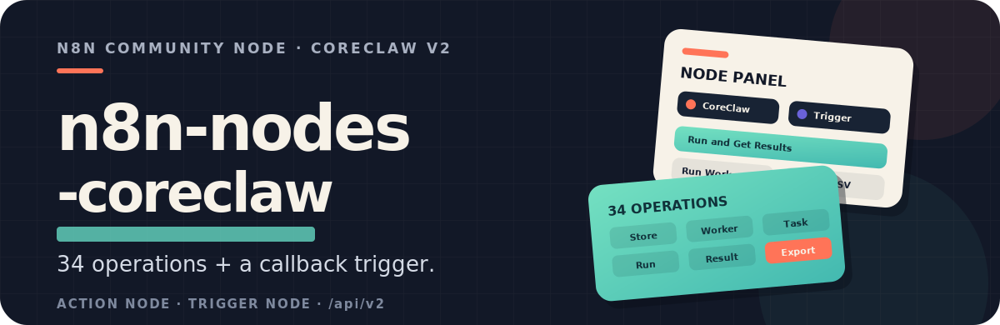
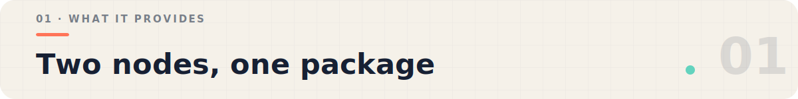
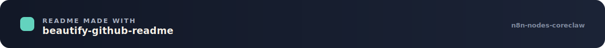

# n8n-nodes-coreclaw

<p align="center">
  
</p>

Use [CoreClaw](https://coreclaw.com) API v2 in n8n to discover workers, run workers and saved tasks, manage worker runs, fetch results, export data, inspect account state, and receive run callbacks.

[n8n](https://n8n.io/) is a workflow automation platform. This package provides:

<p align="center">
  
</p>

- **CoreClaw**: an action node for CoreClaw API v2 workers, worker runs, worker tasks, store workers, proxy regions, and account data.
- **CoreClaw Trigger**: a webhook trigger node for CoreClaw `callback_url` run events.

## Table of contents

- [Installation](#installation)
- [Credentials](#credentials)
- [CoreClaw Node](#coreclaw-node)
- [One-step: Run and Get Results](#one-step-run-and-get-results)
- [Running Workers](#running-workers)
- [CoreClaw Trigger](#coreclaw-trigger)
- [Workflows](#workflows)
- [Error Handling](#error-handling)
- [Troubleshooting](#troubleshooting)
- [Live Tests](#live-tests)
- [Endpoint Scope](#endpoint-scope)
- [Compatibility](#compatibility)

## Installation

Follow the [n8n community nodes installation guide](https://docs.n8n.io/integrations/community-nodes/installation/).

On self-hosted n8n:

1. Go to **Settings > Community Nodes**.
2. Install `n8n-nodes-coreclaw`.
3. Reload the editor. The **CoreClaw** and **CoreClaw Trigger** nodes will appear in the node panel.

## Credentials

1. Create a CoreClaw API key in the CoreClaw console.
2. In n8n, create a credential of type **CoreClaw API**.

| Field | Value |
| --- | --- |
| **API Key** | Your CoreClaw API v2 key. |
| **Base URL** | `https://openapi.coreclaw.com` by default. Change only for private deployments. |

Requests send both `api-key: <key>` and `Authorization: Bearer <key>`. The credential test calls `GET /api/v2/users/account`.

## CoreClaw Node

The action node exposes 34 CoreClaw API v2 operations.

### Store Worker

- **List**: list public store workers, with keyword search and pagination.

### Worker

- **List**
- **Get**
- **Get Input Schema**
- **Run**
- **Run and Get Results** *(run → wait → return result rows in one step)*
- **Get Last Run**
- **Abort Last Run**
- **Export Last Run Results**
- **Get Last Run Log**
- **Rerun Last Run**
- **List Last Run Results**

### Worker Run

- **List**
- **Get Last**
- **Abort Last**
- **Export Last Results**
- **Get Last Log**
- **Rerun Last**
- **List Last Results**
- **Get**
- **Abort**
- **Get Log**
- **Rerun**
- **Rerun and Get Results** *(rerun → wait → return result rows in one step)*
- **List Results**
- **Export Results**

### Worker Task

- **List**
- **Create** — save a worker config as a reusable, optionally scheduled task. Input JSON is sent as `input.parameters.custom`.
- **Get**
- **Update** — update title, description, or schedule (partial).
- **Delete**
- **Get Input** — read a saved task's input payload.
- **Update Input** — replace a saved task's input (wrapped as `input.parameters.custom`).
- **Run**
- **Run and Get Results** *(run → wait → return result rows in one step)*

### Proxy

- **List Regions**

### Account

- **Get Info**

Worker, worker task, and worker run fields use resource locators where useful. You can pick from CoreClaw lists or paste an ID/path manually.

## One-step: Run and Get Results

The **Run and Get Results** operations (on Worker, Worker Task, and Worker Run) run a worker in one node and return the result rows directly — no need to wire separate Run → Get → List Results nodes.

The node:

1. Submits the run asynchronously.
2. Polls `GET /api/v2/worker-runs/{runId}` until the run reaches a terminal status (`succeeded`, `failed`, or `aborted`).
3. Fetches the result rows from `GET /api/v2/worker-runs/{runId}/result` and returns each row as an n8n item.

Use **Return All** to page through every result (capped at 10,000 rows for safety), or set **Offset** / **Limit** for a single page.

If the run finishes unsuccessfully, the node throws an error that includes the run status, `err_msg`, and the run log when available — so you can see why it failed without a separate Get Log step.

> Polling runs client-side for up to ~4 minutes (120 attempts × 2s). For longer jobs, keep **Worker > Run** asynchronous and use **CoreClaw Trigger** with `callback_url` instead.

## Running Workers

**Worker > Run** supports two input modes:

- **Input JSON**: worker business input. The node sends it as `input.parameters.custom`.
- **Raw Input JSON**: advanced full CoreClaw `input` object.

Use one input mode per run. If both are set, the node fails before making a request.

Run, rerun, and worker task run operations support `callback_url`, `is_async`, `offset`, and `limit` where the CoreClaw API supports them.

Enable **Wait for Finish** to poll the returned run through **Get Worker Run Detail** until it reaches a terminal status. For long jobs or event-driven workflows, keep asynchronous mode and use **CoreClaw Trigger** with `callback_url`.

## CoreClaw Trigger

CoreClaw does not currently provide a documented webhook registration API. The **CoreClaw Trigger** node is a local n8n webhook receiver.

Use it by copying the trigger webhook URL into `callback_url` on **Worker > Run**, **Worker Task > Run**, or rerun operations.

The trigger:

- Accepts `POST` callback payloads.
- Can validate `run_id` and `run_status`.
- Can filter events by status: Any, Succeeded, Failed, Running, or Aborted.
- Can include request headers under `_headers`.

Expected callback payload fields include `run_id`, `run_status`, `error_message`, `execution_start_timestamp`, `execution_end_timestamp`, `running_duration`, `result_count`, and `result_message`.

## Workflows

### Run a Worker and Get Results (one step)

1. **CoreClaw: Worker > Run and Get Results** — run, wait, and return result rows in a single node.
2. Pipe the result items straight into your downstream step (spreadsheet, AI, database…).

### Discover, Run, Fetch Results (manual)

1. **CoreClaw: Store Worker > List**
2. **CoreClaw: Worker > Get Input Schema**
3. **CoreClaw: Worker > Run**
4. **CoreClaw: Worker Run > Get**
5. **CoreClaw: Worker Run > List Results**

### Run a Saved Task and Export

1. **CoreClaw: Worker Task > Run and Get Results** — or, to export a file instead of rows:
2. **CoreClaw: Worker Task > Run**
3. **CoreClaw: Worker Run > Export Results**

### Receive Callback Events

1. Add **CoreClaw Trigger** to a workflow.
2. Copy its webhook URL.
3. Paste that URL into `callback_url` on **Worker > Run**, **Worker Task > Run**, or rerun.
4. Use the trigger output in downstream workflow steps.

## Error Handling

CoreClaw API v2 responses use an envelope with `code`, `message`, `data`, and sometimes `request_id` or `details`.

The node:

- Returns `data` when `code` is `0`.
- Throws an n8n API error for non-zero CoreClaw codes.
- Includes CoreClaw messages, details, and request IDs when available.
- Retries only safe GET requests on retryable failures.
- Does not retry run, rerun, or abort POST requests.

Enable **Continue On Fail** in n8n to emit an item containing `error` and `errorDescription` instead of stopping the workflow.

## Troubleshooting

| Symptom | Cause / Fix |
| --- | --- |
| **Credential test fails with `CoreClaw error 12001/12002`** | Invalid API key. Regenerate the key in the CoreClaw console and paste it into the credential. |
| **`Resource not found` (CoreClaw error 11004/50001/70001)`** | Wrong ID. Use the resource locator's **From List** mode to pick a valid worker/task/run, or verify the slug/owner path format (`owner~demo-worker`). |
| **`Insufficient balance` (CoreClaw error 30001)** | Top up the CoreClaw account before running workers. |
| **Run and Get Results never returns** | The run may exceed the ~4-minute polling budget. Switch to asynchronous **Worker > Run** + **CoreClaw Trigger** with `callback_url` for long jobs. |
| **Run and Get Results returns a `failed`/`aborted` error** | The node attaches the run log to the error description. Open the node's error output or check **Continue On Fail** output for the `errorDescription` containing the log. |
| **Empty result rows on a succeeded run** | The worker produced no results. Inspect the run with **Worker Run > Get Log** and validate the input against **Worker > Get Input Schema**. |
| **Webhook trigger never fires** | CoreClaw cannot reach n8n. Set a public `WEBHOOK_URL` (or tunnel) and paste the trigger URL into `callback_url` on the run operation. |

## Live Tests

Live smoke tests are opt-in:

```powershell
$env:CORECLAW_LIVE_TESTS='1'
$env:CORECLAW_API_KEY='<your key>'
npm test -- nodes/CoreClaw/__tests__/e2e.live.test.ts
Remove-Item Env:\CORECLAW_API_KEY
Remove-Item Env:\CORECLAW_LIVE_TESTS
```

Without both environment variables, the live suite is skipped.

## Endpoint Scope

This package intentionally does not expose `POST /api/v2/workers/{workerId}/versions`, `PUT /api/v2/workers/{workerId}/versions/{version}`, or `GET /api/v2/workers/{workerId}/internal`.

## Compatibility

- n8n community node API version 1.
- Node.js `>=20.15`.

## Resources

- [n8n community nodes documentation](https://docs.n8n.io/integrations/#community-nodes)
- [CoreClaw API documentation](https://docs.coreclaw.com/api/)
- [CoreClaw](https://coreclaw.com)

## Changelog

See [CHANGELOG.md](./CHANGELOG.md).

## License

[MIT](./LICENSE)

---

<p align="center">
  
</p>
